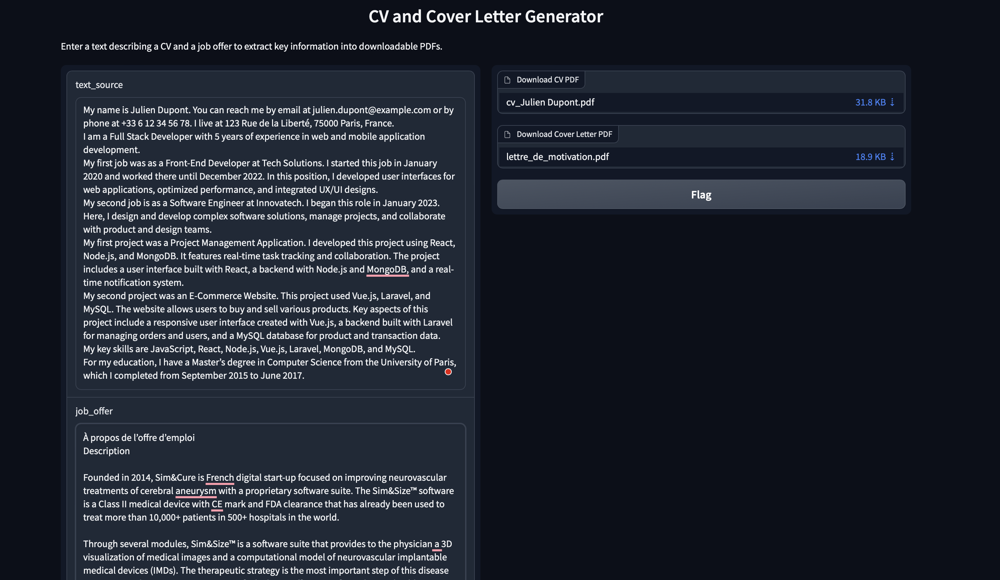
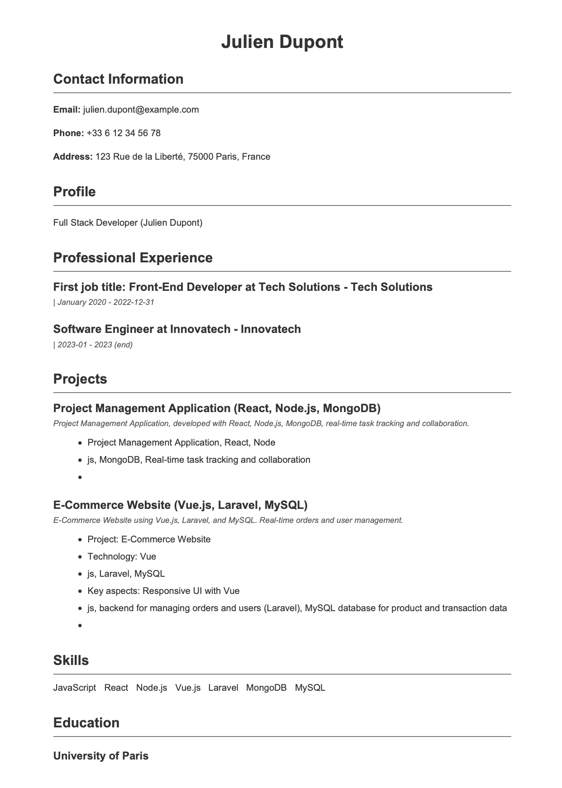
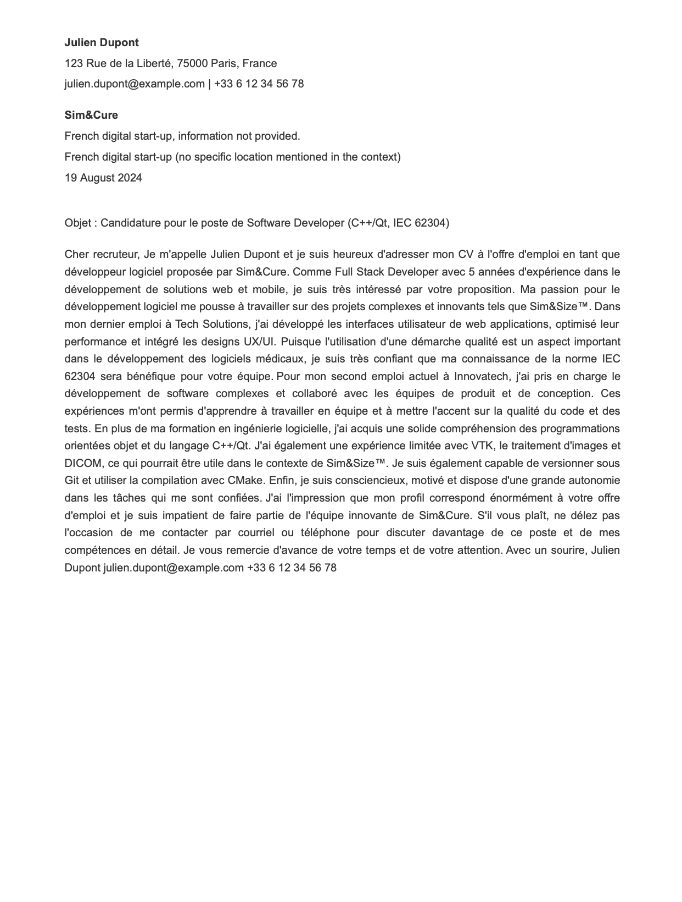

# CV-Generator
AI-Powered CV Generator: Automated Extraction and PDF Creation

Installation des bibliothèques: pip install -r Requirements.txt

Télécharger et installer Ollama sur: https://ollama.com

Lancer la commande pour télécharger le model mistral: ollama pull mistral

Lancement : python interface_gradio.py

## Auteurs
Abdoulaye Baldé
