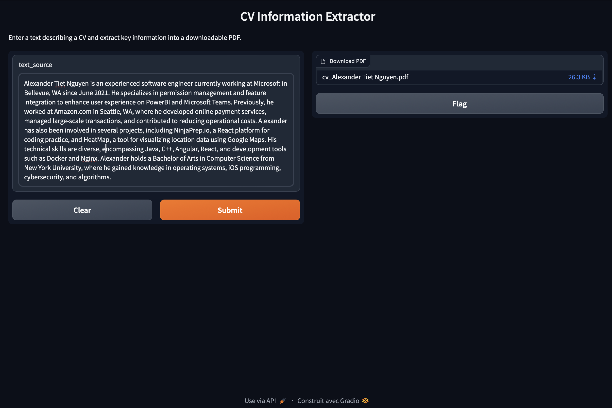
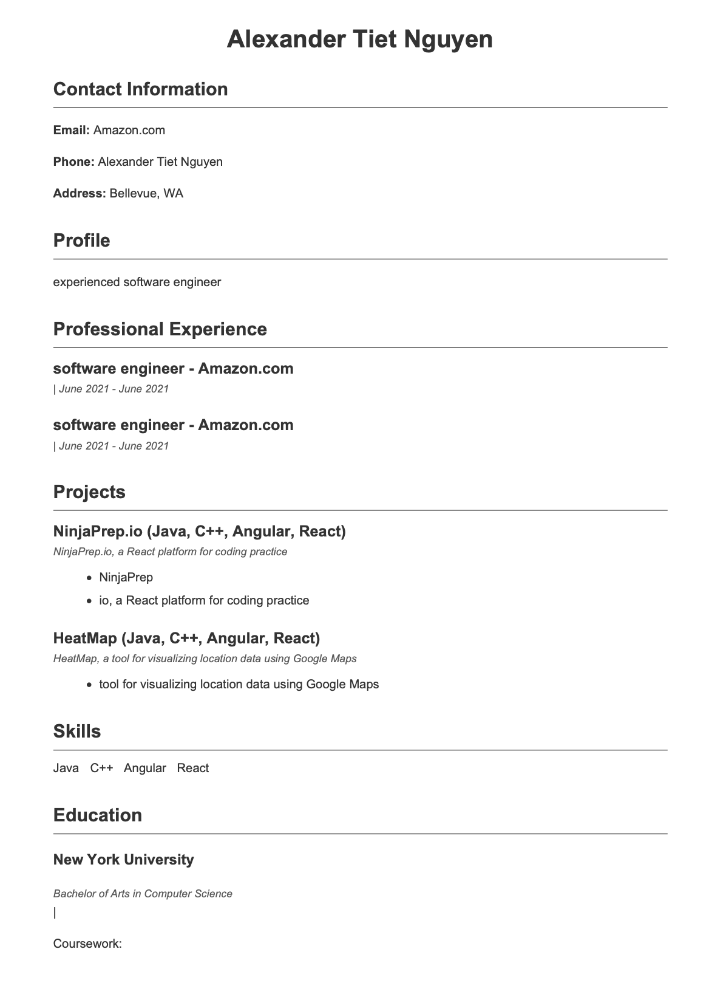

# CV-Generator
AI-Powered CV Generator: Automated Extraction and PDF Creation

Installation des bibliothèques: pip install -r Requirements.txt

Lancement : python interface_gradio.py

## Auteurs
Abdoulaye Baldé
